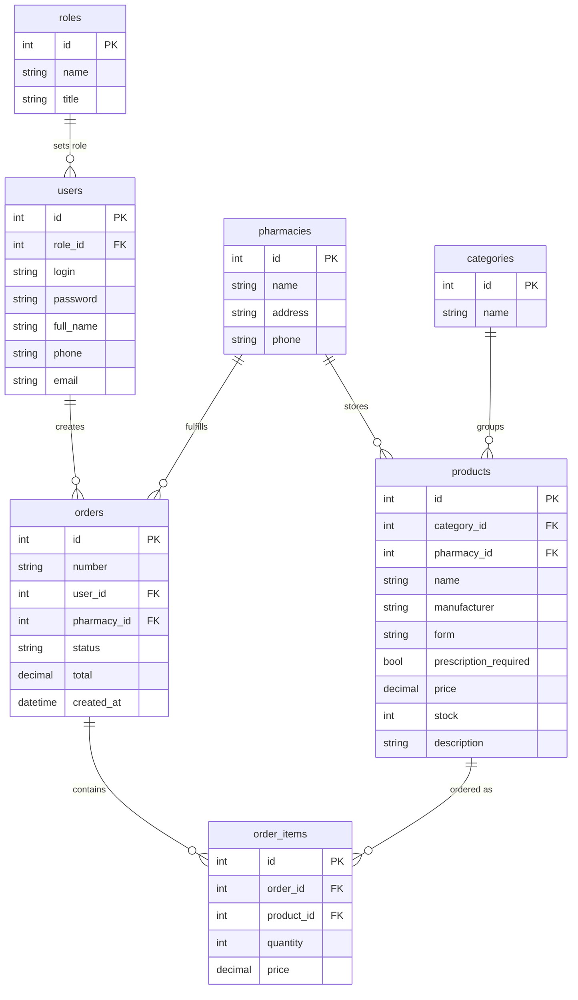

# ERD PharmaFlow

## Covered processes

- Login with role check: guest, client, pharmacist, admin.
- Catalog list with search, filtering and sorting in real time.
- Product card with full object information.
- Add/edit/delete products for privileged roles.
- Cart and order creation with stock validation.
- SQLite database auto-creation and seed data import on first run.
