# ERD PharmaFlow

Ниже описана расширенная модель предметной области. В ней больше 30 сущностей, чтобы проект покрывал не только товары и заказы, но и сотрудников, поставки, склад, контроль процессов, лояльность и аудит.

```mermaid
erDiagram
    roles ||--o{ users : assigns
    user_statuses ||--o{ users : controls
    pharmacies ||--o{ users : assigns
    users ||--|| client_profiles : has
    users ||--|| employee_profiles : has
    pharmacies ||--o{ pharmacy_zones : contains
    pharmacy_zones ||--o{ storage_locations : contains
    categories ||--o{ categories : parent_of
    categories ||--o{ products : classifies
    product_forms ||--o{ products : shapes
    manufacturers ||--o{ products : produces
    suppliers ||--o{ supplier_contacts : owns
    suppliers ||--o{ product_batches : supplies
    products ||--o{ product_batches : grouped_by
    products ||--o{ inventory_balances : counted_in
    pharmacies ||--o{ inventory_balances : stores
    storage_locations ||--o{ inventory_balances : locates
    product_batches ||--o{ inventory_balances : linked_to
    movement_types ||--o{ inventory_movements : types
    products ||--o{ inventory_movements : moves
    pharmacies ||--o{ inventory_movements : within
    users ||--o{ inventory_movements : performs
    order_statuses ||--o{ orders : marks
    payment_methods ||--o{ orders : uses
    users ||--o{ orders : creates
    pharmacies ||--o{ orders : fulfills
    orders ||--o{ order_items : contains
    products ||--o{ order_items : ordered_as
    orders ||--o{ order_status_history : tracked_by
    order_statuses ||--o{ order_status_history : changes_to
    users ||--o{ order_status_history : changes
    orders ||--o{ payments : pays
    payment_methods ||--o{ payments : via
    delivery_statuses ||--o{ deliveries : marks
    orders ||--o{ deliveries : delivered_by
    users ||--o{ prescriptions : owns
    products ||--o{ prescriptions : requires
    supply_statuses ||--o{ supply_requests : marks
    suppliers ||--o{ supply_requests : source
    products ||--o{ supply_requests : requests
    pharmacies ||--o{ supply_requests : destination
    users ||--o{ supply_requests : opens
    supply_statuses ||--o{ purchase_orders : marks
    suppliers ||--o{ purchase_orders : receives
    pharmacies ||--o{ purchase_orders : targets
    users ||--o{ purchase_orders : manages
    purchase_orders ||--o{ purchase_order_items : contains
    products ||--o{ purchase_order_items : buys
    supply_requests ||--o{ purchase_order_items : based_on
    purchase_orders ||--o{ purchase_receipts : closes
    users ||--o{ purchase_receipts : accepts
    promotions ||--o{ product_promotions : maps
    products ||--o{ product_promotions : participates
    users ||--|| loyalty_accounts : owns
    loyalty_accounts ||--o{ loyalty_transactions : changes
    users ||--o{ notifications : receives
    users ||--o{ support_tickets : opens
    users ||--o{ audit_logs : performs

    roles {
        int id PK
        string name
        string title
    }
    user_statuses {
        int id PK
        string name
        string title
    }
    users {
        int id PK
        int role_id FK
        int status_id FK
        int assigned_pharmacy_id FK
        string login
        string password
        string full_name
    }
    client_profiles {
        int user_id PK, FK
        string birth_date
        string address
        string bonus_level
    }
    employee_profiles {
        int user_id PK, FK
        string personnel_number
        string position_title
        decimal salary
    }
    pharmacies {
        int id PK
        string name
        string address
        string phone
    }
    pharmacy_zones {
        int id PK
        int pharmacy_id FK
        string name
        string zone_type
    }
    storage_locations {
        int id PK
        int zone_id FK
        string code
    }
    categories {
        int id PK
        int parent_category_id FK
        string name
    }
    product_forms {
        int id PK
        string name
    }
    manufacturers {
        int id PK
        string name
        string country
    }
    suppliers {
        int id PK
        string name
        string inn
        decimal rating
    }
    supplier_contacts {
        int id PK
        int supplier_id FK
        string full_name
        string phone
    }
    products {
        int id PK
        int category_id FK
        int form_id FK
        int manufacturer_id FK
        string sku
        string name
        decimal base_price
    }
    product_batches {
        int id PK
        int product_id FK
        int supplier_id FK
        string batch_number
        string expiration_date
        decimal purchase_price
    }
    inventory_balances {
        int id PK
        int product_id FK
        int pharmacy_id FK
        int location_id FK
        int batch_id FK
        int quantity
        int reorder_level
    }
    movement_types {
        int id PK
        string name
        string title
    }
    inventory_movements {
        int id PK
        int product_id FK
        int pharmacy_id FK
        int movement_type_id FK
        int performed_by_user_id FK
        int quantity
    }
    order_statuses {
        int id PK
        string name
        string title
    }
    payment_methods {
        int id PK
        string name
        string title
    }
    orders {
        int id PK
        int user_id FK
        int pharmacy_id FK
        int status_id FK
        int payment_method_id FK
        string number
        decimal total
    }
    order_items {
        int id PK
        int order_id FK
        int product_id FK
        int quantity
        decimal price
    }
    order_status_history {
        int id PK
        int order_id FK
        int status_id FK
        int changed_by_user_id FK
        string changed_at
    }
    payments {
        int id PK
        int order_id FK
        int payment_method_id FK
        decimal amount
        string status
    }
    delivery_statuses {
        int id PK
        string name
        string title
    }
    deliveries {
        int id PK
        int order_id FK
        int status_id FK
        string address
        string courier_name
    }
    prescriptions {
        int id PK
        int user_id FK
        int product_id FK
        string doctor_name
        string valid_until
    }
    supply_statuses {
        int id PK
        string name
        string title
    }
    supply_requests {
        int id PK
        int product_id FK
        int supplier_id FK
        int pharmacy_id FK
        int requested_by_user_id FK
        int status_id FK
        int quantity
    }
    purchase_orders {
        int id PK
        int supplier_id FK
        int pharmacy_id FK
        int manager_user_id FK
        int status_id FK
        string number
        decimal total_cost
    }
    purchase_order_items {
        int id PK
        int purchase_order_id FK
        int product_id FK
        int supply_request_id FK
        int quantity
    }
    purchase_receipts {
        int id PK
        int purchase_order_id FK
        int received_by_user_id FK
        string received_at
    }
    promotions {
        int id PK
        string name
        decimal discount_percent
        string start_date
        string end_date
    }
    product_promotions {
        int id PK
        int product_id FK
        int promotion_id FK
    }
    loyalty_accounts {
        int id PK
        int user_id FK
        int points
        string tier
    }
    loyalty_transactions {
        int id PK
        int account_id FK
        int points_delta
        string reason
    }
    audit_logs {
        int id PK
        int actor_user_id FK
        string action_type
        string target_table
        int target_id
    }
    notifications {
        int id PK
        int user_id FK
        string title
        string is_read
    }
    support_tickets {
        int id PK
        int user_id FK
        string subject
        string status
    }
```

## Почему такая схема сильнее

- Клиентская часть больше не висит только на таблицах `users`, `products`, `orders`: теперь есть профиль клиента, бонусы, платежи, доставки и рецепты.
- Менеджерская роль получила самостоятельный контур данных: поставщики, контакты, заявки на поставку, закупки, приёмки и складские остатки.
- Администратор теперь управляет не абстрактными пользователями, а сотрудниками со статусами, ролями, профилями, назначением на аптеку и журналом действий.
- Склад и движение товара разделены на партии, остатки, зоны хранения и движения, поэтому ERD лучше отражает реальные процессы.

## Бизнес-процессы, которые теперь покрыты

- регистрация клиента и авторизация по ролям;
- просмотр каталога и оформление заказа клиентом;
- контроль заказов по аптеке для менеджера;
- создание и отслеживание заявок на поставку;
- найм, блокировка и увольнение сотрудников администратором;
- аудит действий пользователей и контроль процессов по сети.
